# homework4

## 1.跑通建图流程，保存地图并显示完整地图
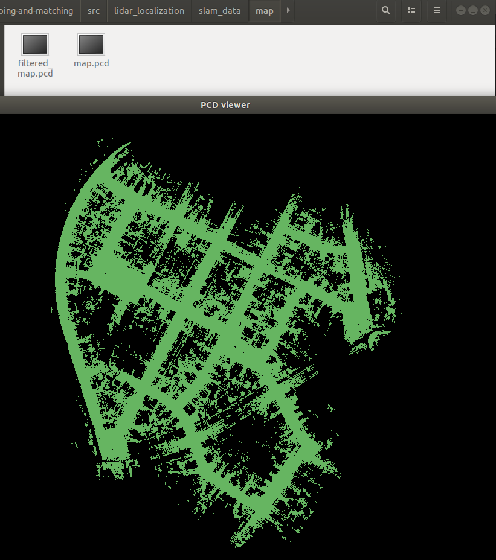 

## 2.加载点云地图，在原点实现初始化
### 方式一：SetScanContextPose
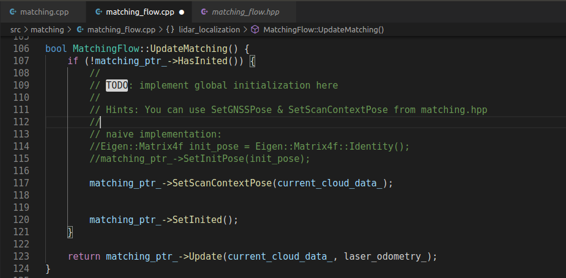 
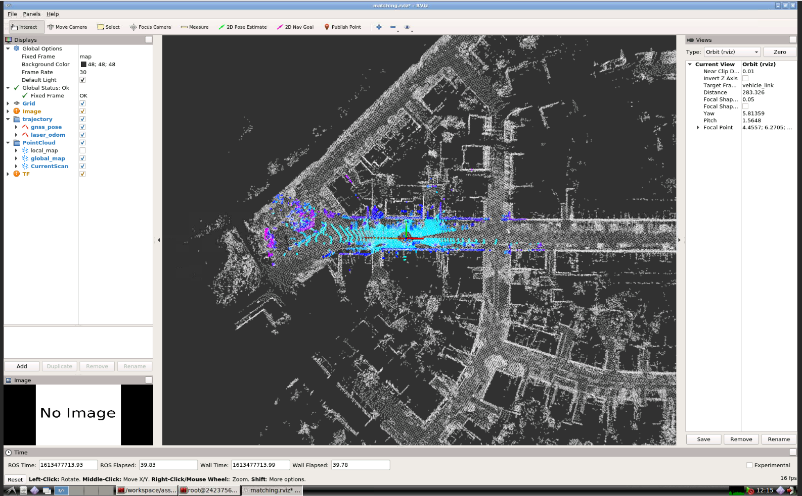

### 方式二：SetGNSSPose
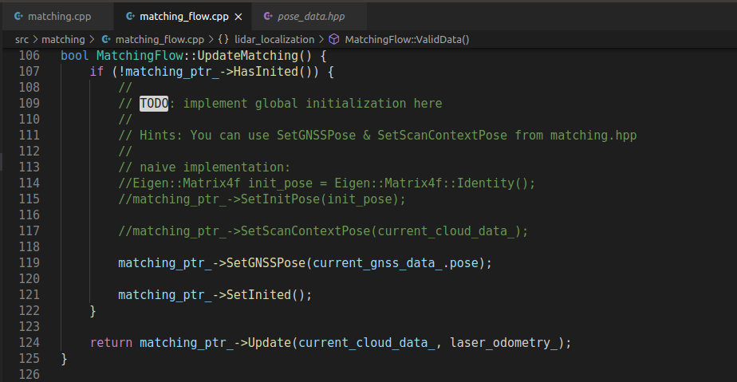
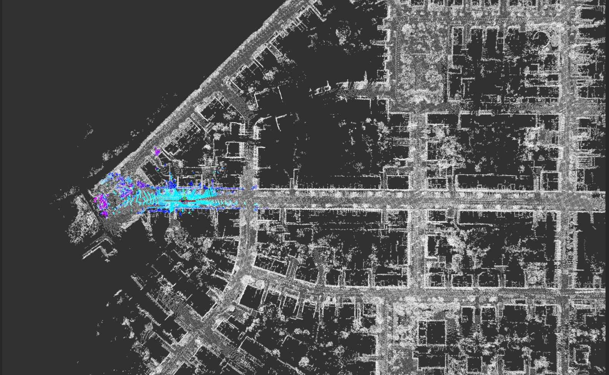

## 3.全局初始化
### 方式一：SetScanContextPose
#### 首先记录初始位置gnss信息
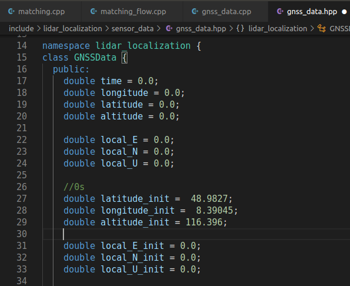

#### 计算和初始化位置的偏差并修正
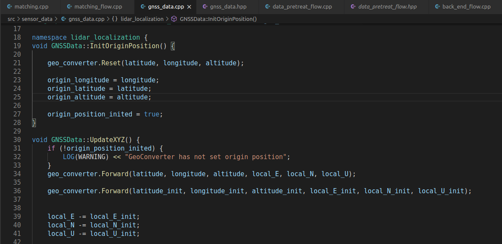

#### 100s初始化
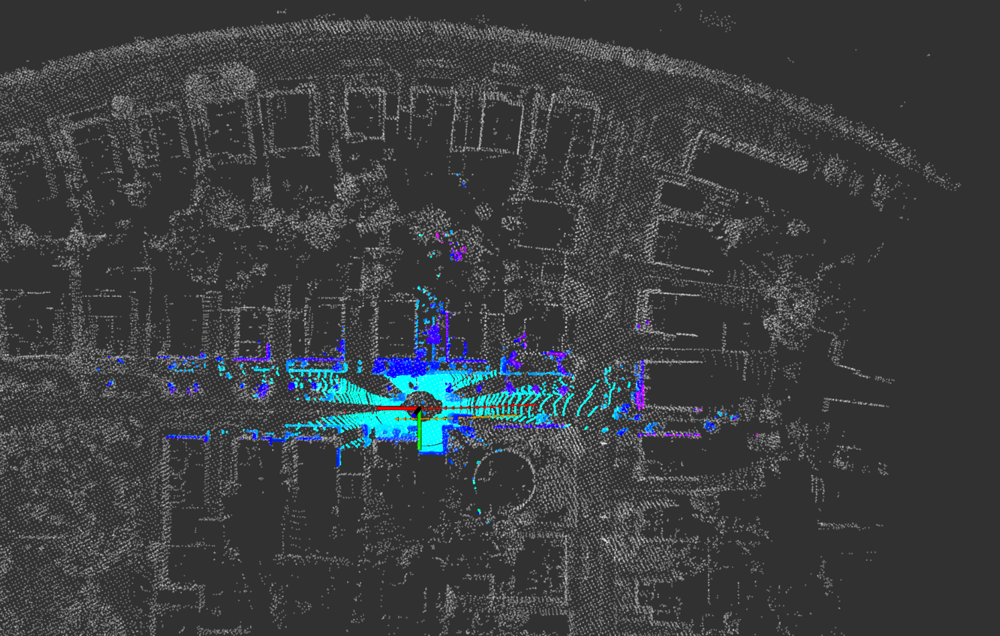
### 200s初始化
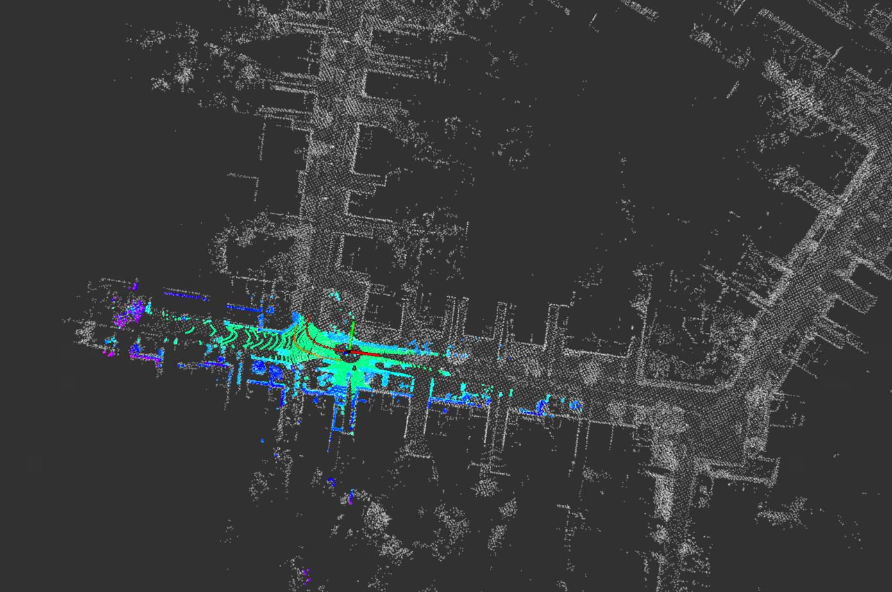
### 300s初始化
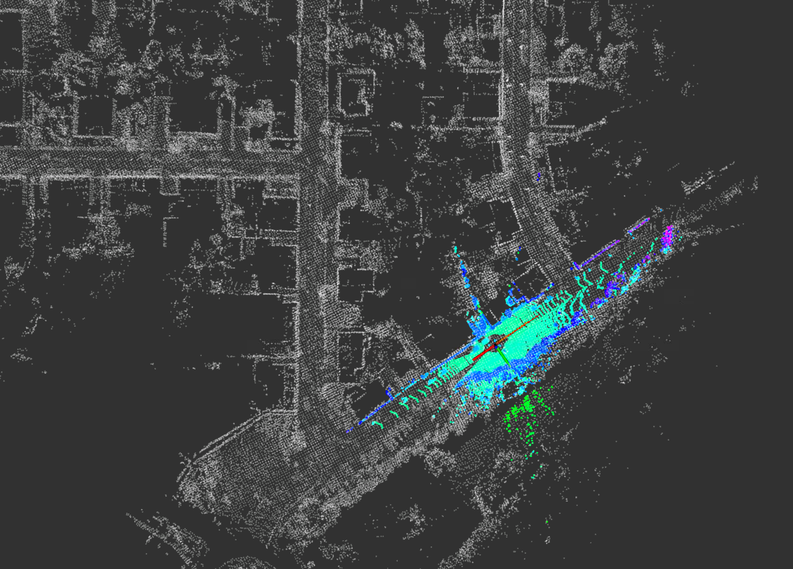
#### 400s初始化
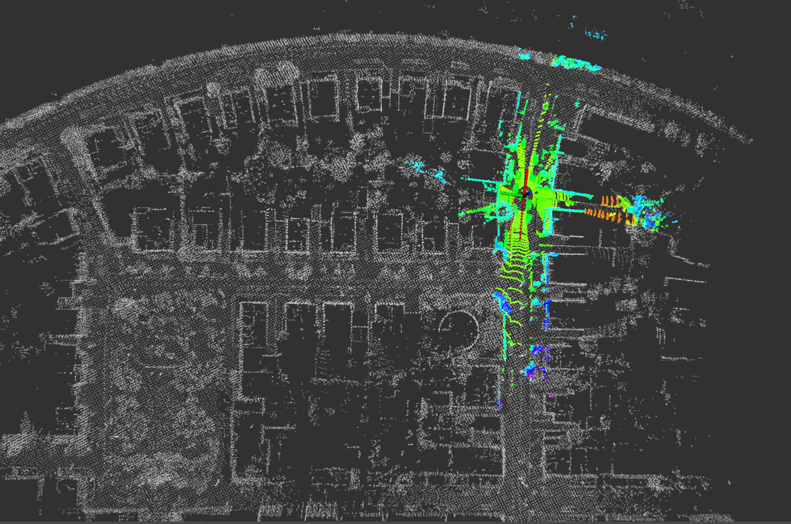

### 方式二：SetGNSSPose
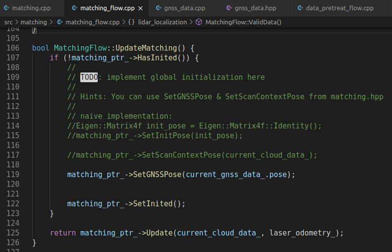

#### 100s初始化
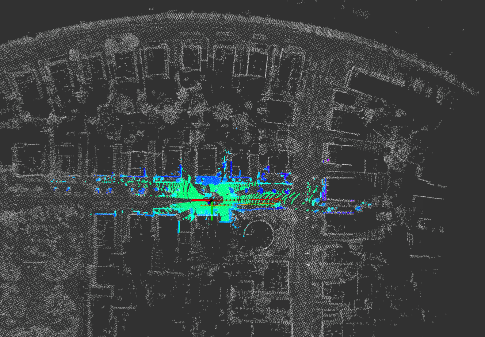
#### 200s初始化
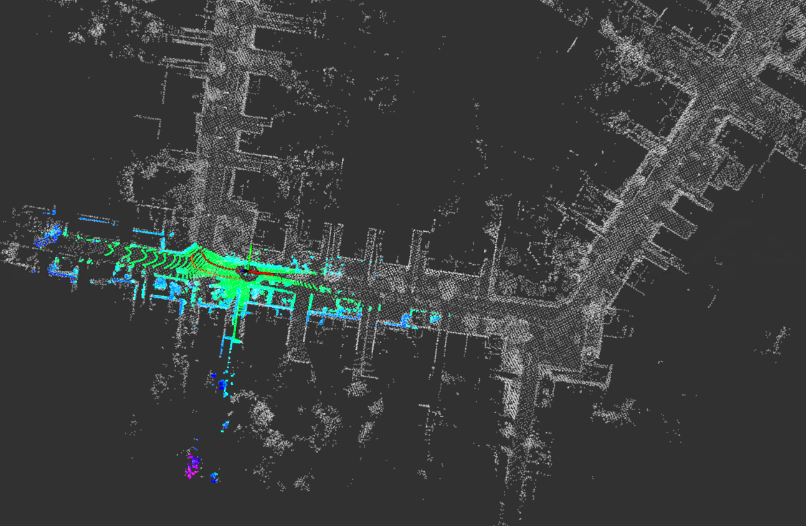
#### 300s初始化
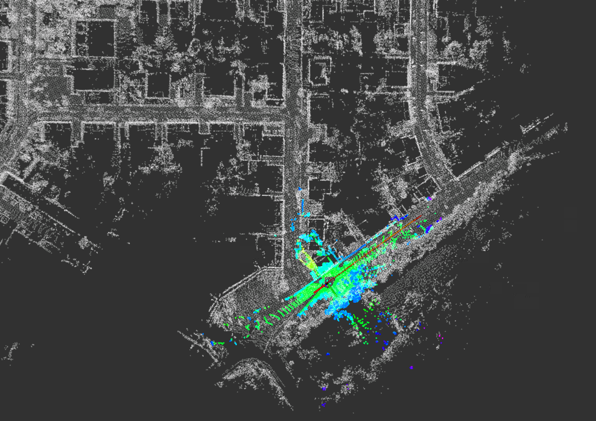
#### 400s初始化
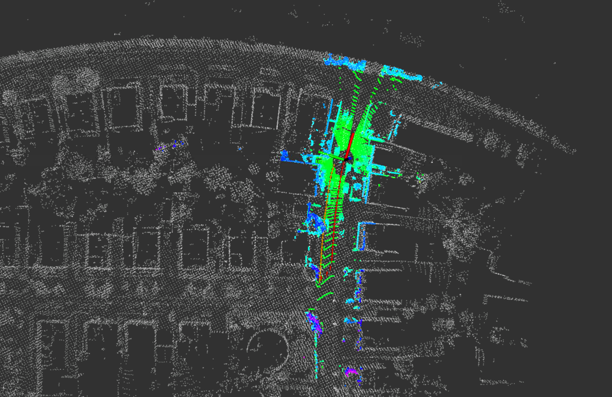

