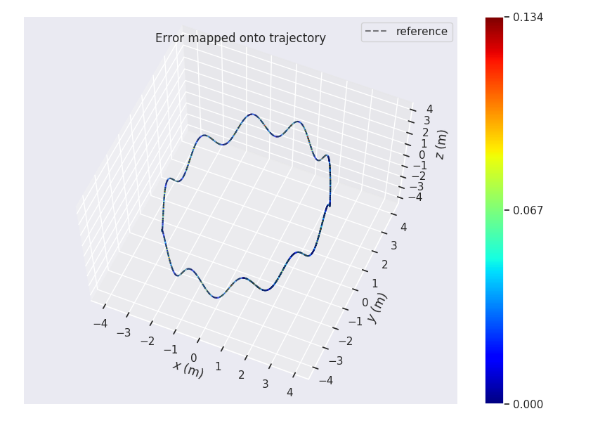
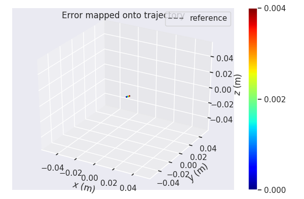

# homework 6

## 完成中值法解算

按照TODO提示填空
 

中值法结果如下：
 

## 完成欧拉法解算
角度和速度变化函数有差别

 
 
 

欧拉法解算结果如下：

## 精度对比分析
更新位姿时保存解算位姿和ground_truth

 
 
 

使用evo评测，欧拉法ape和轨迹如下：

 
 
 
 

中值法ape和轨迹如下：

 
 
 
 

可以看出在给定的数据下中值法精度要优于欧拉法。

## gnss-ins-sim生成仿真数据

将ref_pos写入rosbag中，注意记录初始位姿，最后在odom中减去初始位姿：

 
 

记录gnss-ins-sim中静止状态重力矢量，解算程序中对应修改：

 
 

## 对比欧拉法和中值法精度差异与运动状态关系

### 静止状态

euler：

mid-value：

### 匀速

euler:

mid-value：

### 匀加速

euler:

mid-value：

### 转弯

euler:

mid-value：

### 总结

可以看出静止状态和匀速状态下欧拉法和中值法差别很小  
匀加速状态中值法精度明显优于欧拉法  
在设定的多转弯状态下中值法精度也稍好于欧拉法  

解算过程中欧拉法取的是上一时刻状态，中值法对上一时刻和当前时刻状态做了平均。   
1、静止和匀速状态下没有速度变化，积分的值相同，两种解算结果应该一致；  
2、匀加速状态欧拉法积分结果小于中值法，匀减速状态欧拉法积分结果大于中值法，理论上中值法结果应该更加准确；  
3、在转弯较多情况下中值法对速度积分结果也应该更为准确。  

