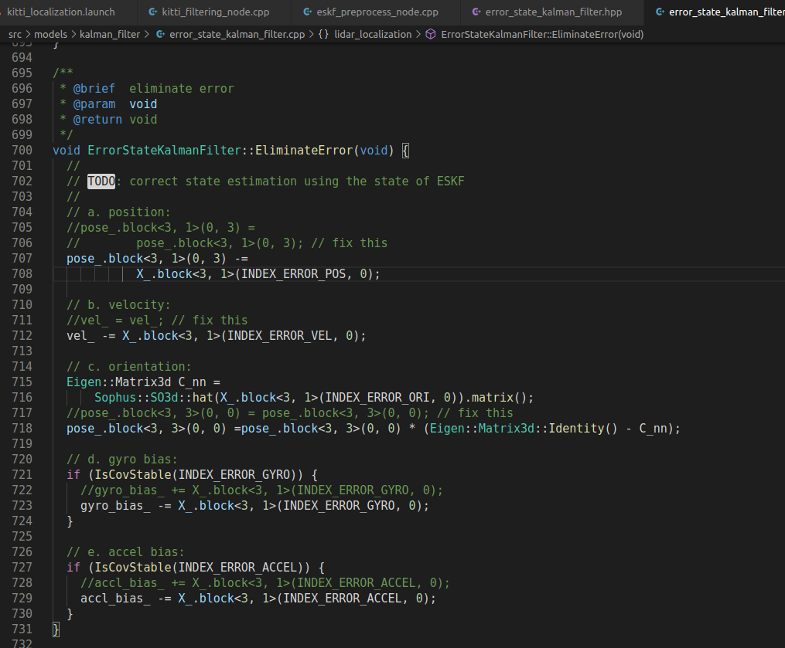
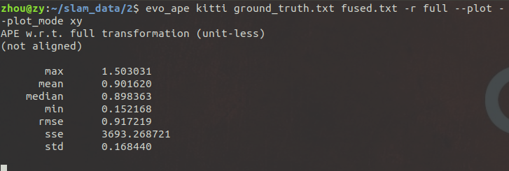

# homework 6

## 1.补全滤波代码

修改F矩阵和B矩阵，对应公式填写代码

 
 
 
 
 

滤波结果如下：

 

## 2.调试参数，使得滤波后性能更好

初始参数evo评测结果如下：

 
 

分别增大和减小先验噪声P

 
 

 
 

增大过程噪声Q，减小测量噪声R

 
 

减小过程噪声Q，增大测量噪声R

 
 

分析发现：  
P 是误差协方差初始值，表示对当前预测状态的信任程度    
Q越大越信任观测值  ，融合结果和激光更接近  
R越大越信任预测值

调出的一组较优参数如下：

 
 

融合后evo评测ape的结果中 max、mean、median、min都是融合后更优，其他参数也更为接近

## 3.不考虑随机游走推导模型并实现，对比性能差异并给出对比结果

主要是B矩阵形式不同

 
 

设置了与2中相同的6组参数：

 
 

 
 

 
 

 
 

 
 

 
 

