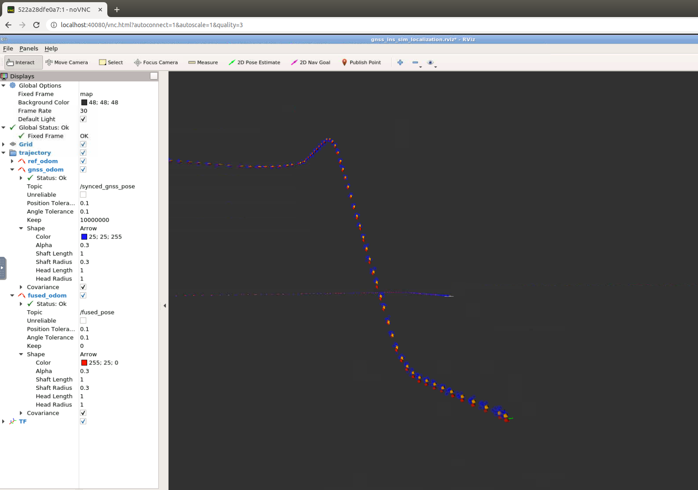

# homework8

## 1.融合运动模型

按照PPT中模型更改Y、G和C矩阵

 

融合结果如下：

## 2.实现新模型，且效果有改善
保存y轴和z轴速度，使用evo评测：

 

不考虑运动模型结果如下：

可以看出考虑运动模型后y轴和z轴的均值方差均有改善

## 3.增加编码器融合，并分析精度

与问题一类似，按照PPT修改Y、矩阵：

轨迹和evo评测如下：

不考虑编码器融合结果如下：

 

可以看出未融合编码器模型融合后结果漂移较大。
