# homework9

## 1.推导雅各比，补全代码

雅各比推导如下：

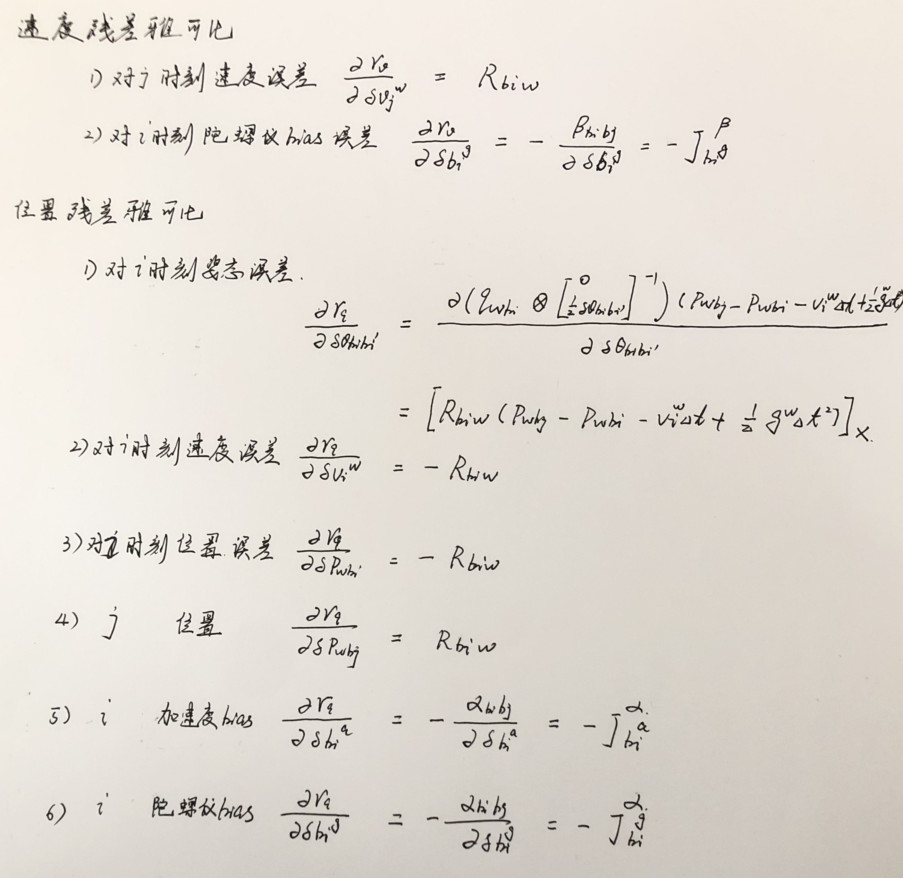 

imu预积分状态更新如下：

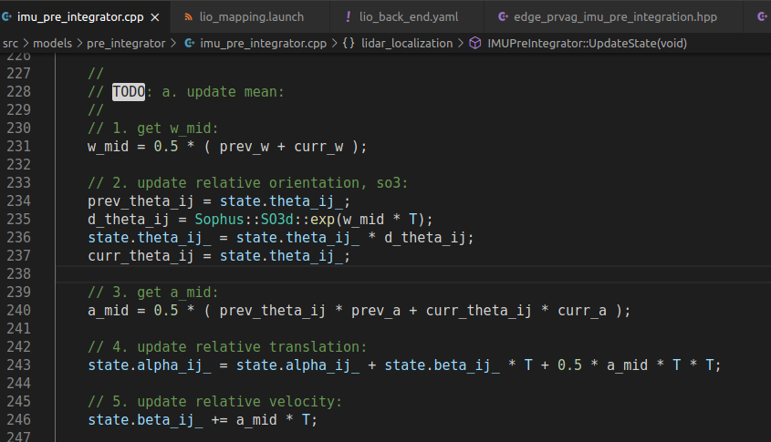 

更新F和G矩阵：

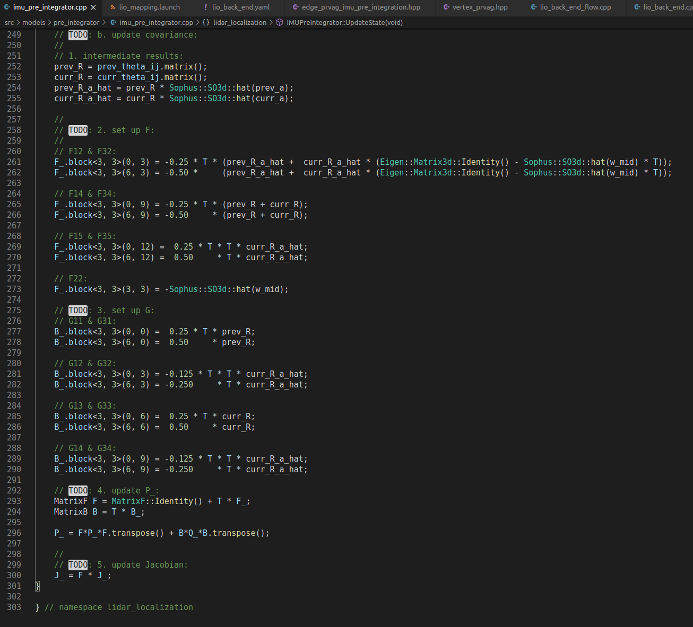 

g2o计算误差：

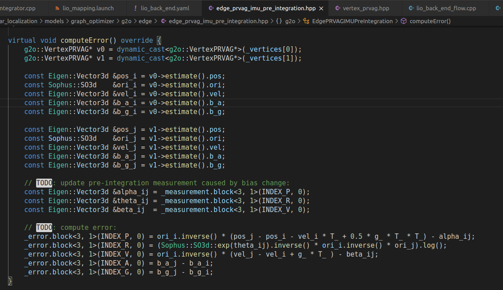

加法运算定义如下：

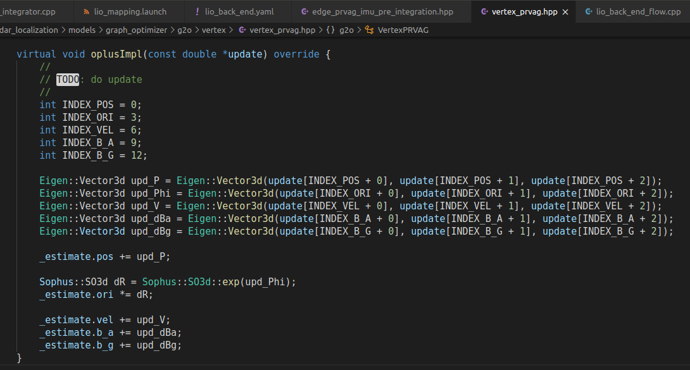

运行结果：

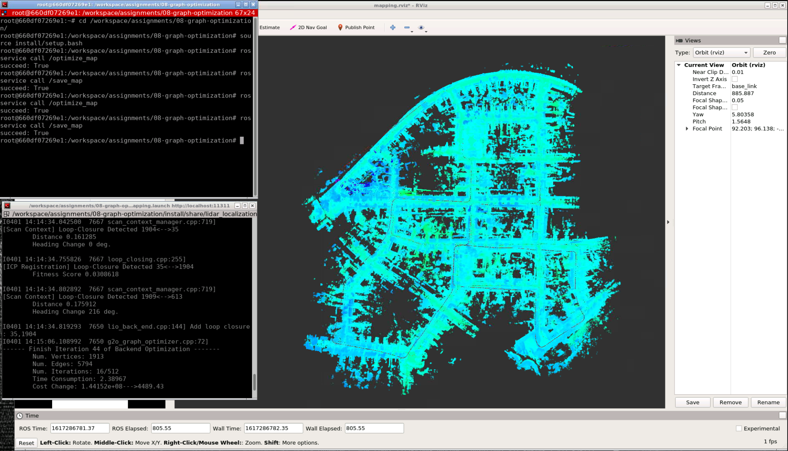 

## 2.实现和不加IMU时的效果对比分析

没有IMU预积分ape:

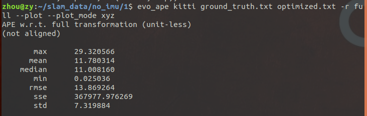

有IMU预积分ape:

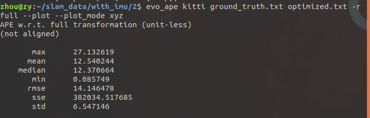

可以看出有IMU预积分后误差最大值和标准差都有改善。

无IMU预积分部分地图：

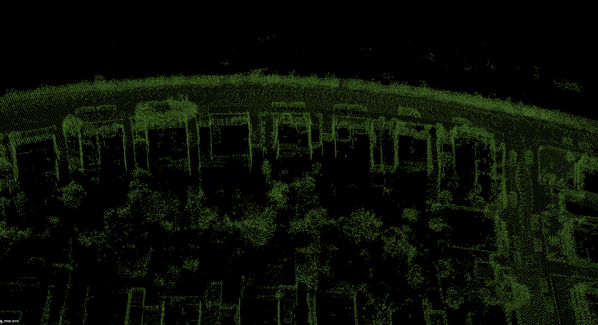 

添加IMU预积分部分地图：

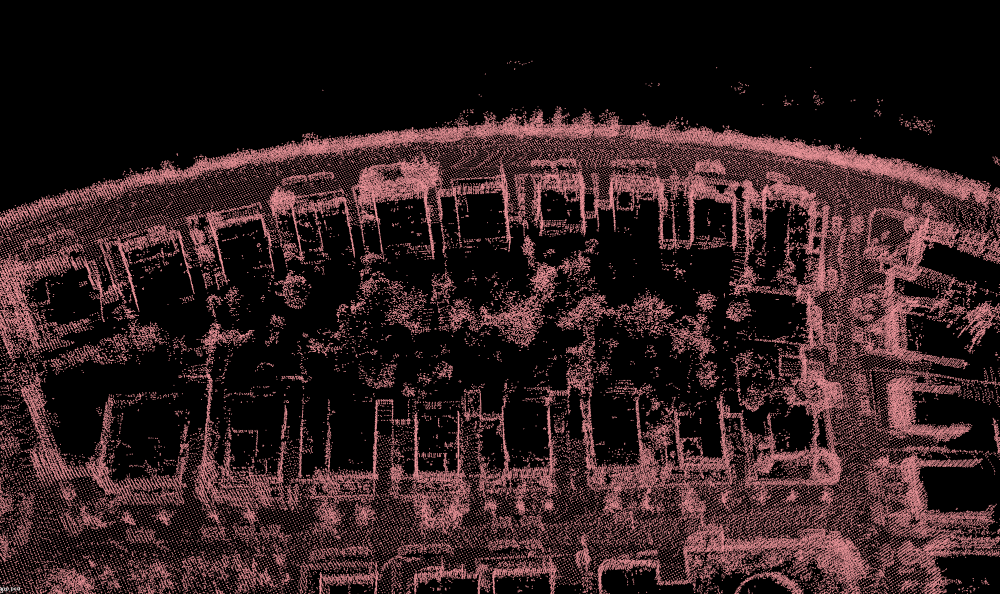

通过对比可以发现增加IMU预积分后地图细节更加完善。

## 3.融合编码器预积分推导

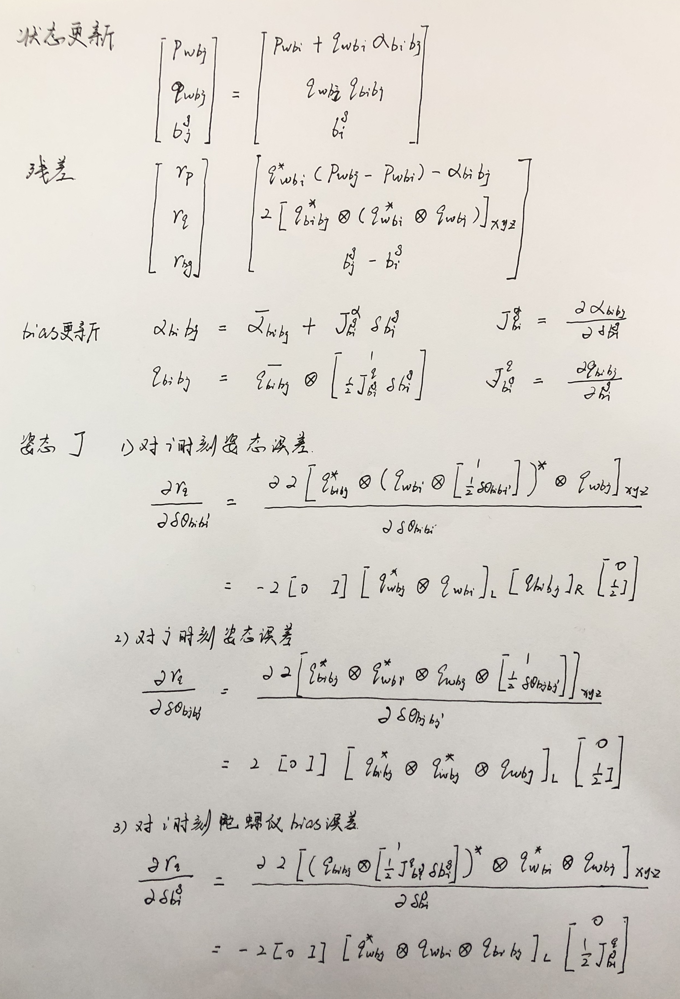 

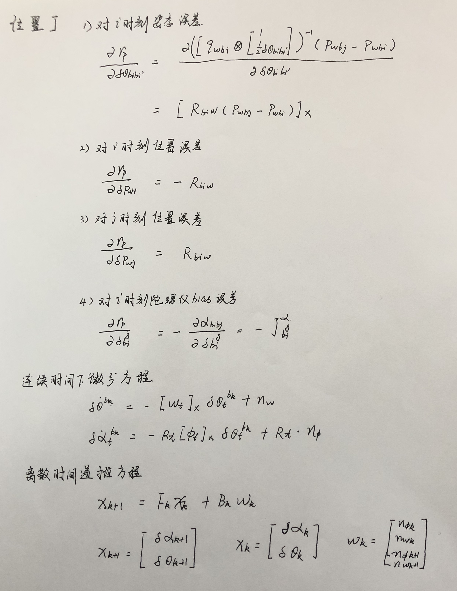 

 

